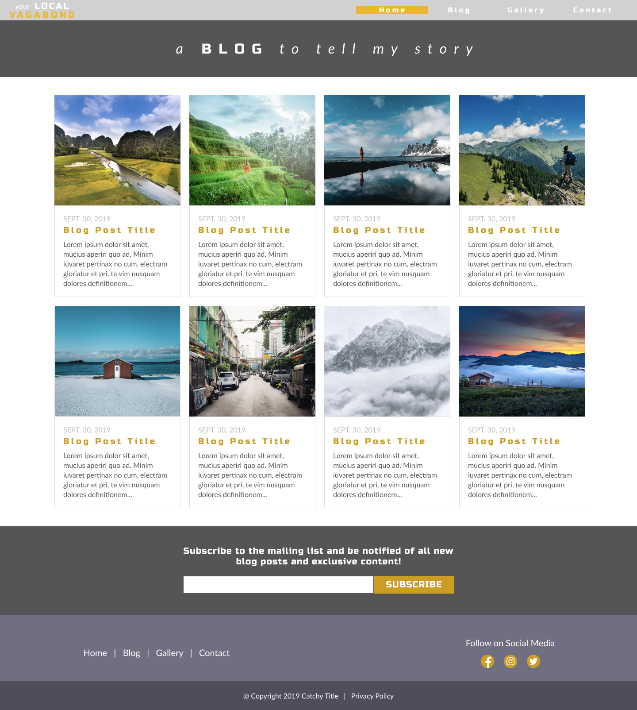
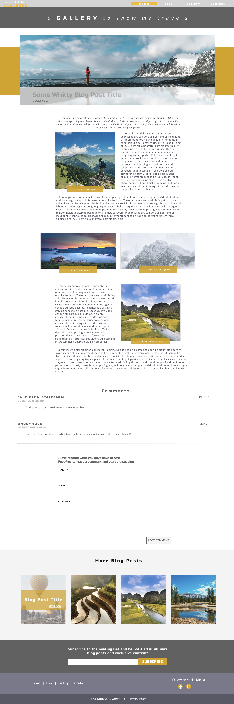
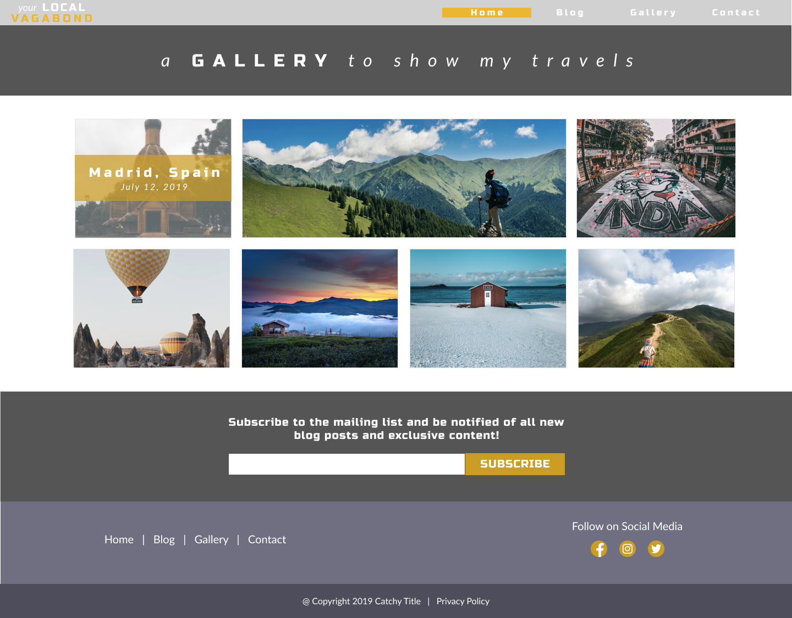
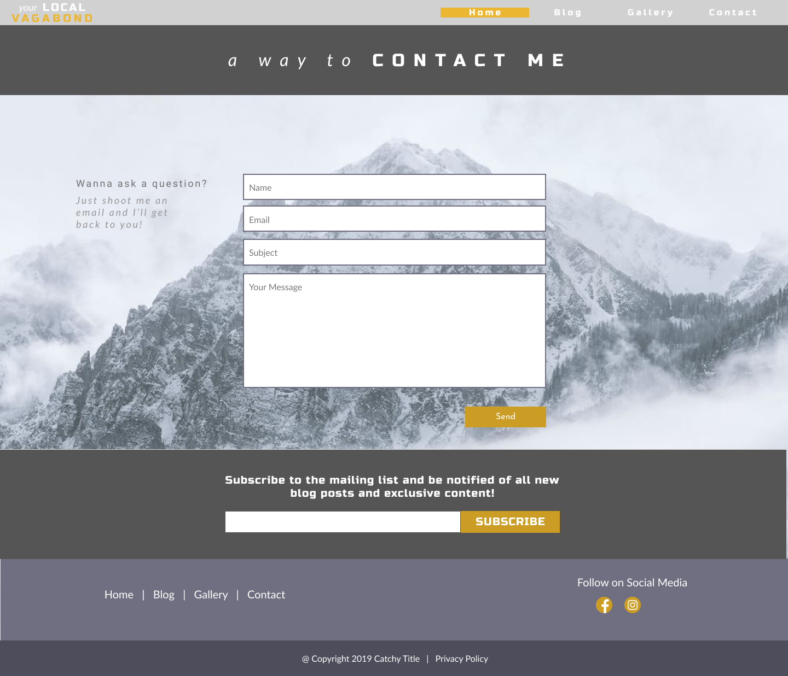

# Travel Blog Concept

## Summary
I created this site as a fun personal project that would demonstrate my skillset regarding graphic design and web development technologies.  
The site was implemented using HTML, CSS/SASS, and JavaScript and was conceptualized using the design software Figma. 
  
This is merily a concept, and as such there are certain features that are not implemented. These features include pagination on the "Blog" page, 
as well as working contact forms on the "Contact" page. Hope you enjoy :)
  

## Preview

### Home Page

### Blog Page

### Single Blog Post

### Gallery Page

### Contact Page

## Future Adaptations
This was my first full site that I successfully implemented, and so looking back on it, there are a lot of things I'd change given the time to do so. 
<ul>
  <li>Utilize Bootstrap and Flex</li>
  <li>Restucture File Organization and Naming Conventions</li>
  <li>Migrate Entire Site to WordPress (for funsies)</li>
  <li>Fully Implement Pagination</li>
</ul>
